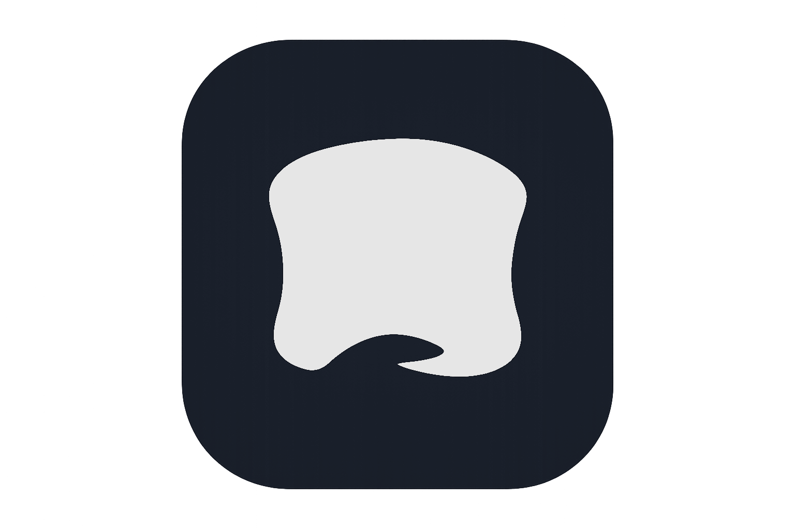

<p align="center">
  
</p>

<p align="center">
  A single-user Flask web app for chatting with LLM character cards.
</p>

## About

Cozy is a lightweight, self-hosted chat interface for SillyTavern-compatible
V2 character cards. It supports personas, lorebooks, prompt presets, themes,
and any OpenAI-compatible LLM endpoint.

## Quick start

### Python

```bash
uv sync
uv run python app.py
```

App runs on http://localhost:5001.

### Docker

```bash
cd docker
docker compose -f docker/docker-compose.yml up -d --build
```

## Documentation

- [docs/run.md](docs/run.md) — running the app
- [docs/db.md](docs/db.md) — database schema

---
Howdy! This whole app is vibe coded slop. If that bothers you...🤷
The code is going to see constant changes most of the time and I'm never going to call it stable. Though I'm currently trying to avoid breaking changes between version and ensuring there are proper migrations to keep things stableish. If you try to checkout an old version to use, do not expect it will then migrate to a newer version. It'll probably just die. This really only started as a project to see how far I could actually take vibe coding but then it completely replaced SillyTavern for my use. Maybe other people will like it? I dunno but AI can be purty neat.
